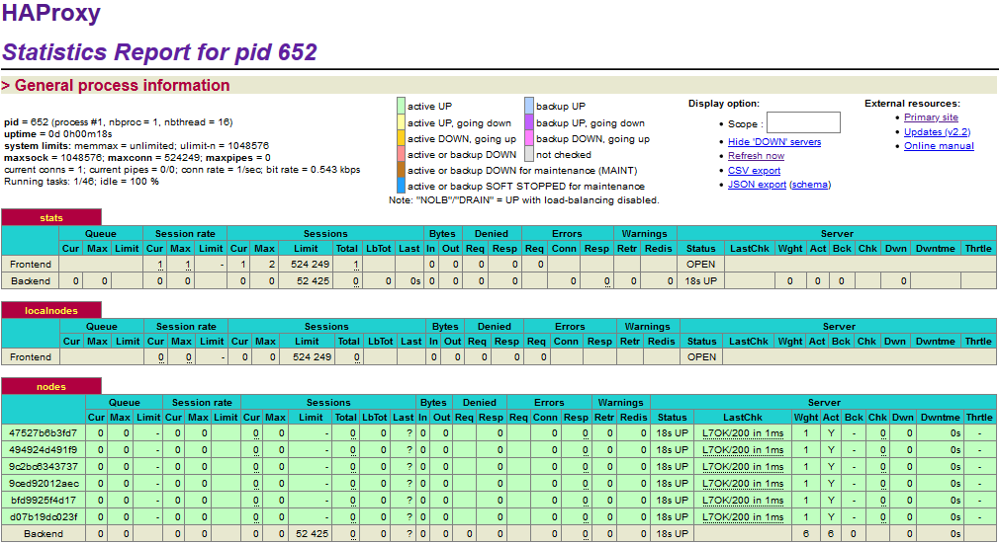

# HEIG AIT - Laboratory 4 - Docker
## Authors
Arthur Bécaud and Bruno Egremy.
## GitHub repository
https://github.com/b3cauda/Teaching-HEIGVD-AIT-2020-Labo-Docker
## Table of contents
- [Introduction](#introduction)
- [Tasks](#tasks)
  - [T0: Identify issues and install the tools](#task-0)
    - [Questions](#task-0-questions)
    - [Deliverables](#task-0-deliverables)
  - [T1: Add a process supervisor to run several processes](#task-1)
    - [Deliverables](#task-1-deliverables)
  - [T2: Add a tool to manage membership in the web server cluster](#task-2)
    - [Deliverables](#task-2-deliverables)
  - [T3: React to membership changes](#task-3)
    - [Deliverables](#task-3-deliverables)
  - [T4: Use a template engine to easily generate configuration files](#task-4)
    - [Deliverables](#task-4-deliverables)
  - [T5: Generate a new load balancer configuration when membership changes](#task-5)
    - [Deliverables](#task-5-deliverables)
  - [T6: Make the load balancer automatically reload the new configuration](#task-6)
    - [Deliverables](#task-6-deliverables)
- [Difficulties](#difficulties)
- [Conclusion](#conclusion)

## Introduction
This lab builds on the previous lab on load balancing. The main objectives are to simulate a scalable environment using docker and to understand the concepts for dynamic scaling of an application in production.

## Tasks
### <a name="task-0"></a>T0: Identify issues and install the tools
### <a name="task-0-questions"></a>Questions
> **[M1]** Do you think we can use the current solution for a production environment? What are the main problems when deploying it in a production environment?

Our current solution is not ready for a production environment because it is not dynamic and needs manual configuration of each node in the haproxy configuration file. This results in the need to build a new haproxy docker image each time we want to scale the number of backend nodes, which is not usable in a production environment.

> **[M2]** Describe what you need to do to add a new web app container to the infrastructure. Give the exact steps of what you have to do without modifying the way things are done. Hint: You probably have to modify some configuration and script files in a Docker image.

First, we have to add a new environment variable for the new web app in the `.env`.
```
WEBAPP_1_NAME=s1
WEBAPP_2_NAME=s2
WEBAPP_3_NAME=s3
WEBAPP_1_IP=192.168.42.11
WEBAPP_2_IP=192.168.42.22
WEBAPP_3_IP=192.168.42.33

...
```
Then add a new service in the `docker-compose.yml`.
```
version: "3.5"

services :
  ...

  webapp3:
       container_name: ${WEBAPP_3_NAME}
       build:
         context: ./webapp
         dockerfile: Dockerfile
       networks:
         heig:
           ipv4_address: ${WEBAPP_3_IP}
       ports:
         - "4002:3000"
       environment:
            - TAG=${WEBAPP_3_NAME}
            - SERVER_IP=${WEBAPP_3_IP}

  haproxy:
       container_name: ha
       build:
         context: ./ha
         dockerfile: Dockerfile
       ports:
         - 80:80
         - 1936:1936
         - 9999:9999
       expose:
         - 80
         - 1936
         - 9999
       networks:
         heig:
           ipv4_address: ${HA_PROXY_IP}
       environment:
            - WEBAPP_1_IP=${WEBAPP_1_IP}
            - WEBAPP_2_IP=${WEBAPP_2_IP}
...
```
And finally, update the `haproxy.cfg` configuration file and make a new ha image build.

```
...
# Define the backend configuration. In fact, that's the part that configures what is not directly
# accessible from the outside of the network.
# http://cbonte.github.io/haproxy-dconv/2.2/configuration.html#4
backend nodes
    ...

    # Define the list of nodes to be in the balancing mechanism
    # http://cbonte.github.io/haproxy-dconv/2.2/configuration.html#4-server
    server s1 ${WEBAPP_1_IP}:3000 check
    server s2 ${WEBAPP_2_IP}:3000 check
    server s3 ${WEBAPP_3_IP}:3000 check

```
> **[M3]** Based on your previous answers, you have detected some issues in the current solution. Now propose a better approach at a high level.

A better high-level approach would be to add and remove the web app containers dynamically to remove the need of updating all the configuration files.

> **[M4]** You probably noticed that the list of web application nodes is hardcoded in the load balancer configuration. How can we manage the web app nodes more dynamically?

We could have a proxy that actively scans containers around him or make the web app introduce themselves toward the proxy when they are up.

> **[M5]** In the physical or virtual machines of a typical infrastructure we tend to have not only one main process (like the web server or the load balancer) running, but a few additional processes on the side to perform management tasks.
>
> For example to monitor the distributed system as a whole it is common to collect in one centralized place all the logs produced by the different machines. Therefore we need a process running on each machine that will forward the logs to the central place. (We could also imagine a central tool that reaches out to each machine to gather the logs. That's a push vs. pull problem.) It is quite common to see a push mechanism used for this kind of task.
>
> Do you think our current solution can run additional management processes besides the main webserver/load balancer process in a container? If no, what is missing/required to reach the goal? If yes, how to proceed to run for example a log forwarding process?

Our current solution can only handle one process per container due to the docker policy. It is currently impossible to add a side process to run a monitoring agent on each container but it may be possible to integrate the agent directly within the main process of each container.

To solve the side process issue, we need to use an *init system*, also called *process supervisor*, to run as the main process of our containers. This main process will then handle the side processes such as the haproxy, the web app, or the monitoring agent.

> **[M6]** In our current solution, although the load balancer configuration is changing dynamically, it doesn't follow dynamically the configuration of our distributed system when web servers are added or removed. If we take a closer look at the run.sh script, we see two calls to sed which will replace two lines in the haproxy.cfg configuration file just before we start haproxy. You clearly see that the configuration file has two lines and the script will replace these two lines.
>
> What happens if we add more web server nodes? Do you think it is really dynamic? It's far away from being a dynamic configuration. Can you propose a solution to solve this?

As we saw in the **[M2]** question, the load balancer may be changing dynamically but he is not able to add or remove any nodes dynamically. We need a solution such as the one we provided in the **[M4]** question.

### <a name="task-0-deliverables"></a>Deliverables
**1.**
> Take a screenshot of the stats page of HAProxy at http://192.168.42.42:1936. You should see your backend nodes.


**2.**
> Give the URL of your repository URL in the lab report.

https://github.com/b3cauda/Teaching-HEIGVD-AIT-2020-Labo-Docker

### <a name="task-1"></a>T1: Add a process supervisor to run several processes
### <a name="task-1-deliverables"></a>Deliverables
**1.**
>  Take a screenshot of the stats page of HAProxy at http://192.168.42.42:1936. You should see your backend nodes. It should be really similar to the screenshot of the previous task.


**2.**
> Describe your difficulties with this task and your understanding of what is happening during this task. Explain in your own words why are we installing a process supervisor. Do not hesitate to do more research and to find more articles on that topic to illustrate the problem.

We encountered no difficulties during these tasks.

We are installing a process supervisor to overcome the docker policy of running a single process per container. A classic docker container will run only when there is a foreground process running. In our case we want many processes to run in the background. To do so we need a process supervisor that will run in the foreground and handle our multiple background processes.

### <a name="task-2"></a>T2: Add a tool to manage membership in the web server cluster
### <a name="task-2-deliverables"></a>Deliverables
**1.**
> Provide the docker log output for each of the containers: `ha`, `s1`, and `s2`. You need to create a folder `logs` in your repository to store the files separately from the lab report. For each lab, the task creates a folder and name it using the task number. No need to create a folder when there are no logs.
>
> Example:
> ```
> |-- root folder
>   |-- logs
>     |-- task 1
>     |-- task 3
>     |-- ...
> ```

Logs : [ha](../logs/task2/ha) / [s1](../logs/task2/s1) / [s2](../logs/task2/s2)

**2.**
> Give the answer to the question about the existing problem with the current solution.

Due to the simplicity of our solution, all our nodes will register to the same cluster through the `ha` node.
This may result in nodes not being able to join the cluster if the `ha` container is not running or ready.

**3.**
> Give an explanation on how `Serf` is working. Read the official website to get more details about the `GOSSIP` protocol used in `Serf`. Try to find other solutions that can be used to solve similar situations where we need some auto-discovery mechanism.

Serf works with a gossip protocol to communicate with nodes.

´´´
A gossip protocol is a procedure or process of computer peer-to-peer communication that is based on the way epidemics spread.
´´´ - [Wikipedia](https://en.wikipedia.org/wiki/Gossip_protocol)

The Serf agents periodically exchange messages with each other in much the same way that the coronavirus spread: it starts with one person but soon infects everyone.

*This first part of the response was highly inspired by the [Serf features section from their website](https://www.serf.io/#features).*

Another solution we could use for auto-discovery is `Treafik`. We used it in another module. It works using the Docker API to discover running containers and to recover data about them such as running services.

### <a name="task-3"></a>T3: React to membership changes
### <a name="task-3-deliverables"></a>Deliverables
**1.**
> Provide the docker log output for each of the containers: `ha`, `s1`, and `s2`. Put your logs in the `logs` directory you created in the previous task.

Start ha:
- [ha log](../logs/task3/log1)

Start s1:
- [s1 log](../logs/task3/log2)
- [ha log](../logs/task3/log3)

Start s2:
- [s2 log](../logs/task3/log4)
- [ha log](../logs/task3/log5)

**2.**
> Provide the logs from the `ha` container gathered directly from the `/var/log/serf.log` file present in the container. Put the logs in the `logs` directory in your repo.

[/var/log/serf.log](../logs/task3/serf)

### <a name="task-4"></a>T4: Use a template engine to easily generate configuration files
### <a name="task-4-deliverables"></a>Deliverables
**1.**
> You probably noticed when we added `xz-utils`, we have to rebuild the whole image which took some time. What can we do to mitigate that? Take a look at the Docker documentation on [image layers](https://docs.docker.com/storage/storagedriver/). Tell us about the pros and cons to merge as much as possible of the command. In other words, compare:
> ```
> RUN command 1
> RUN command 2
> RUN command 3
> ```
> vs.
> ```
> RUN command 1 && command 2 && command 3
> ```
> There are also some articles about techniques to reduce the image size. Try to find them. They are talking about `squashing` or `flattening` images.

A Docker image is built upon a series of layers representing each instruction in the image’s Dockerfile. Each layer is incremental, meaning that each layer will add the difference from their previous layer to the total image size.

The pros in using the first solution (multiple runs) are the readability. It is way easier to understand each simple run than a big chunk of commands. Another pro is the easiness of removing one or multiple parts of the command without the risk of messing with another command.

However, there is a possible con due to the multiples layers. It's possible that some layers are dependent on one another and that some of the files will be created for example at the first layer then removed at the second and finally recreated in a third layer. Due to the incremental procedure, this specific file's state will be saved three times and therefore take way more space than in a case where we would have used the second chained solution. This is one of many scenarios that could happen.

The solution to reducing a docker image size is mainly to reduce the number of layers (and to remove any unnecessary dependencies) in using the second solution with the chain of commands.

Another technique is to flatten an image with the ` --squash` parameter in the Docker image build. This will flatten every newly built layer into one.

**2.**
> Propose a different approach to architecture our images to be able to reuse as much as possible what we have done. Your proposition should also try to avoid as much as possible repetitions between your images.

A different approach would be to use a base image for both the web app and the HAProxy to group the commons dependencies such as the label, S6 and Serf install to avoid as much as possible repetitions between the images.

**3.**
> Provide the `/tmp/haproxy.cfg` file generated in the `ha` container after each step. Place the output into the `logs` folder like you already did for the Docker logs in the previous tasks. Three files are expected.

Running all containers with `docker-compose up --build`:
- [log](../logs/task4/log1).

ha running and s1 start:
- [log](../logs/task4/log2).

s2 start:
- [log](../logs/task4/log3).

> In addition, provide a log file containing the output of the `docker ps` console and another file (per container) with `docker inspect <container>`. Four files are expected.

- [docker ps](../logs/task4/docker_ps).

- docker inspect: [ha](../logs/task4/inspect_ha) / [s1](../logs/task4/inspect_s1) / [s2](../logs/task4/inspect_s2).

**4.**
> Based on the three output files you have collected, what can you say about the way we generate it? What is the problem if any?

The `member-join.sh` script only outputs one line at a time in the `/tmp/haproxy.cfg` file. This is due to the output with the `>` on line 16 of the script and not the `>>` which would add to the file instead of erasing it before pasting new content.

### <a name="task-5"></a>T5: Generate a new load balancer configuration when membership changes
### <a name="task-5-deliverables"></a>Deliverables
**1.**
> Provide the file `/usr/local/etc/haproxy/haproxy.cfg` generated in the `ha` container after each step. Three files are expected.

Running all containers with `docker-compose up --build`:
- [haproxy config](../logs/task5/haproxy_conf1).

ha running and s1 start:
- [haproxy config](../logs/task5/haproxy_conf2).

s2 start:
- [haproxy config](../logs/task5/haproxy_conf3).

> In addition, provide a log file containing the output of the `docker ps` console and another file (per container) with `docker inspect <container>`. Four files are expected.

- [docker ps](../logs/task5/docker_ps1).

- docker inspect: [ha](../logs/task5/inspect_ha) / [s1](../logs/task5/inspect_s1) / [s2](../logs/task5/inspect_s2).

**2.**
> Provide the list of files from the `/nodes` folder inside the `ha` container. One file expected with the command output.

[nodes](../logs/task5/nodes1).

**3.**
> Provide the configuration file after you stopped one container and the list of nodes present in the `/nodes` folder. One file expected with the command output. Two files are expected.

- [haproxy config](../logs/task5/haproxy_conf4).
- [nodes](../logs/task5/nodes2).

> In addition, provide a log file containing the output of the `docker ps` console. One file expected.

[docker ps](../logs/task5/docker_ps2).

**4.**
> (Optional:) Propose a different approach to manage the list of backend nodes. You do not need to implement it. You can also propose your own tools or the ones you discovered online. In that case, do not forget to cite your references.

`Treafik` is one approach we could use to manage dynamically our backend nodes. We already talked about this tool previously in this report.

### <a name="task-6"></a>T6: Make the load balancer automatically reload the new configuration
To simplify the scalability of our environment, we updated the docker-compose.yml to only run two services, a web app, and a haproxy.

```yml
version: "3.5"

services :
  webapp:
   build:
     context: ./webapp
     dockerfile: Dockerfile

  haproxy:
    container_name: ha
    build:
     context: ./ha
     dockerfile: Dockerfile
    ports:
     - 80:80
     - 1936:1936
     - 9999:9999
    expose:
     - 80
     - 1936
     - 9999
```
And with this, we can use the `--scale` parameter of docker-compose to run multiple backend nodes.

The only issue with this implementation is that we lost the `tag` attribute which results in the loss of the sticky session functionality. But it is not important for the objectives of this task so we will ignore it for now.

### <a name="task-6-deliverables"></a>Deliverables
**1.**
> Take a screenshot of the HAProxy stat page showing more than 2 web applications running. Additional screenshots are welcome to see a sequence of experimentations like shutting down a node and starting more nodes.

Using our new docker-compose file, we used the following command to run 4 backend nodes:   
`docker-compose up -d --scale webapp=4 --build`


Then we can downscale it to only 2 backend nodes:
`docker-compose up -d --scale webapp=2`


Then we can upscale it to 6 backend nodes:
`docker-compose up -d --scale webapp=6`



The `docker-compose up ...` console output looks like this by the way.
```
PS C:\Users\b3cauda\Documents\HEIG-VD\Modules\AIT\Labos\Labo4_Docker> docker-compose up -d --scale webapp=4 --build
...
Creating ha                    ... done
Creating labo4_docker_webapp_1 ... done
Creating labo4_docker_webapp_2 ... done
Creating labo4_docker_webapp_3 ... done
Creating labo4_docker_webapp_4 ... done
PS C:\Users\b3cauda\Documents\HEIG-VD\Modules\AIT\Labos\Labo4_Docker> docker-compose up -d --scale webapp=2
Stopping and removing labo4_docker_webapp_3 ...
Stopping and removing labo4_docker_webapp_3 ... done
Stopping and removing labo4_docker_webapp_4 ... done
PS C:\Users\b3cauda\Documents\HEIG-VD\Modules\AIT\Labos\Labo4_Docker> docker-compose up -d --scale webapp=6
ha is up-to-date
Creating labo4_docker_webapp_3 ... done
Creating labo4_docker_webapp_4 ... done
Creating labo4_docker_webapp_5 ... done
Creating labo4_docker_webapp_6 ... done
```

> Also provide the output of `docker ps` in a log file. At least one file is expected. You can provide one output per step of your experimentation according to your screenshots.

- [4 backend nodes](../logs/task6/docker_ps_4_backend_nodes).
- [2 backend nodes](../logs/task6/docker_ps_2_backend_nodes).
- [6 backend nodes](../logs/task6/docker_ps_6_backend_nodes).

**2.**
> Give your own feelings about the final solution. Propose improvements or ways to do things differently. If any, provide references to your readings for the improvements.

We think that our final solution is pretty smooth and we are satisfied with it. One improvement we could implement is the fix of the current `tag` issue we made with the new docker-compose file. We could solve it by using the container time set dynamically by docker `labo4_docker_webapp_1`, `labo4_docker_webapp_2`... `labo4_docker_webapp_<n>`.

**3.**
> (Optional:) Present a live demo where you add and remove a backend container.

## Difficulties
We only had a few difficulties due to the Windows environment in which we have done the lab. The script files we edited were using the CRLF format instead of the LF format which resulted in many errors in the docker container. We had to change all the end lines symbols to fix these issues.

## Conclusion
In conclusion, this lab was interesting and provided us a good practice over the theory we had during classes. Even though we already used Docker, Docket-Compose, and Traefik, the lab did reinforce our knowledge of these tools.
